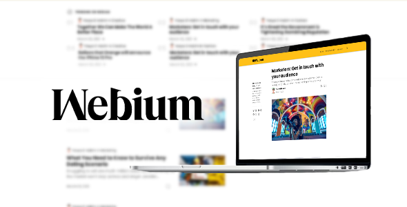

# Webium Blogger Theme

   

Webium is a Blogger Template or Theme that looks very similar to the Medium.com. [View Demo](https://webium-blogger.blogspot.com/).

The appearance is really very similar. However, there are a few things that need to be improved as this has a huge impact on the accessibility and inconsistent layout on Medium.com.

If you have questions related to this theme, please write in the [Comments](https://www.elcreativeacademy.com/2021/03/webium-template-blogger-mirip-medium.html) or [Discussions](https://github.com/elhakimyasya/Webium-Blogger-Theme/discussions) page.

> _Recently, we are trying to update all the structure and design of the Webium Theme to look very much like the original Website._
>
> _Old files can be found in [/old](https://github.com/elhakimyasya/Webium-Blogger-Theme/tree/main/old) directory._
>
> _Always support us by simply donating via [Ko-Fi](https://ko-fi.com/elhakimyasya) or [PayPal](https://www.paypal.me/yasyaelhakim/5) 😃._

## Webium v3 Update Progress

[Webium v3 - Live Demo 1 (Beta)](https://idpdthemes.blogspot.com/) | [Webium v3 - Live Demo 2 (Beta)](https://technoidious.blogspot.com/)

> _Please contact me if you want to be a tester for this version._

-   ✅ Home Page
-   ✅ Search Page
-   ✅ Archive Page
-   ✅ Label Page
-   ✅ Error Page
-   ✅ Post Page
-   ✅ Static Page
-   ✅ Comments (Partially)
-   ❌ Gadgets

## Contribution

## Credits

-   [Tailwind CSS](https://tailwindcss.com/)
-   [LazySizes](https://github.com/aFarkas/lazysizes)
-   [Medium Zoom](https://github.com/francoischalifour/medium-zoom)
-   [Easy Toggle State](https://github.com/Twikito/easy-toggle-state)
-   [Simple AJAX infinite scroll](https://dte.web.id/teknis/blogger-infinite-scroll)
-   Some Images from [Unsplash](https://unsplash.com/)

## More Info

-   [Documentation](https://webium-blogger.blogspot.com/p/webium-documentations.html)
-   [Official Website](https://www.elcreativeacademy.com/)

## License

Webium Blogger Theme is licensed under the [MIT License](LICENSE).
